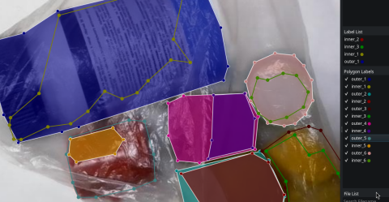
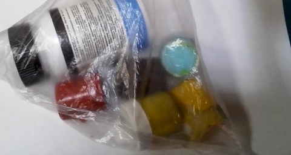
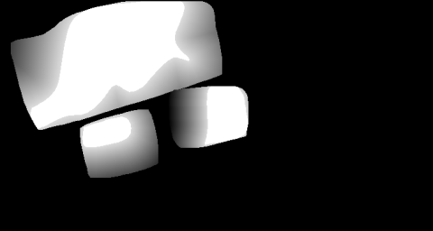
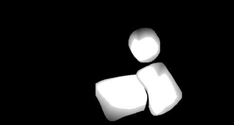

## Motivation

In many real-world scenes, objects do not have sharp binary boundaries.

Examples include:
- Objects behind transparent or reflective surfaces (plastic, glass, film)
- Motion blur and defocus blur
- Multiple layers partially occluding the object
- Low-contrast transitions between object and background

Using hard binary masks in such scenarios introduces label noise and unrealistic step transitions, which negatively affect U-Net training and convergence.

---

## Core Idea

Instead of providing strict 0/1 segmentation masks, this project uses soft probabilistic masks generated from nested contours.

The object is annotated entirely, while a confidence gradient defines:

- High certainty region (clearly visible object core → probability = 1.0)
- Transition region (blur, occlusion, transparency → smoothly decreasing probability)
- Background (no object → probability = 0.0)

This allows the network to learn:

- Physical visibility transitions
- Uncertain boundaries
- Robust object presence estimation

rather than artificial binary cuts.





---

## Benefits

- Improved convergence stability  
- Better segmentation in blurry and transparent regions  
- Reduced label noise  
- More realistic supervision

This method is especially effective for transparent materials, soft boundaries, and visually degraded objects.


## Installation (Debian)

  ```bash
  sudo apt update
  curl --proto '=https' --tlsv1.2 -sSf https://sh.rustup.rs | sh
  source "$HOME/.cargo/env"
  sudo apt install -y libopencv-dev pkg-config clang git
  git clone https://github.com/sinushkin/soft-unet
  cd soft-unet
  cargo build --release
  ./target/release/soft-unet ./path-to-labelme-json-folder
  ls out/
  ```


Литература ;-)
- https://www.youtube.com/watch?v=oxWfLTQoC5A
- https://www.youtube.com/watch?v=_3S3eTvBEns
